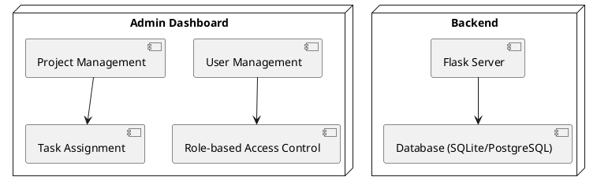
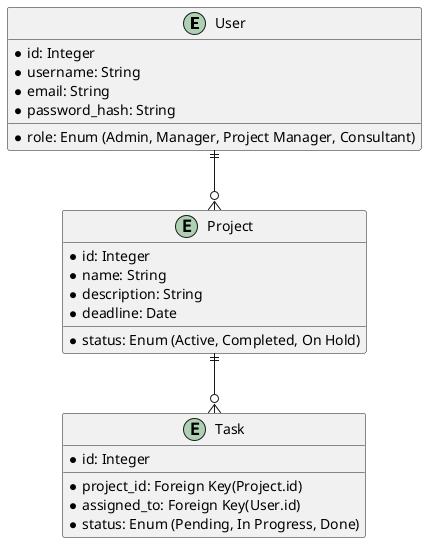

= Specification Document: Resource Planning Application

== Introduction
This document provides an overview of the Resource Planning Application, describing its key functionalities, architecture, and implementation plan. The goal of the application is to facilitate resource planning and management across projects, clients, and consultants, ensuring smooth collaboration and tracking of project progress.

== Overview
The application provides a web-based platform for managing projects, clients, and product catalogs. It includes an **Admin Dashboard** to oversee system operations, manage users, and generate reports. The system is role-based, ensuring appropriate access levels for **Admins, Managers, Project Managers, and Consultants**.

== Modules

=== Authentication & Security
- User authentication via Flask-Login
- Role-based access control (RBAC)
- Secure password management and session handling
- Multi-factor authentication (planned for future releases)

=== User Management
- Admins can create, update, and delete users
- Role-based permission assignment
- Viewing a list of all users

=== Project Management
- Managers and Project Managers can create and assign projects
- Task management, including task assignment and completion tracking
- Setting project deadlines
- Status tracking for ongoing projects

=== Client Management
- Adding, editing, and removing client records
- Assigning projects to specific clients

=== Product Catalog
- Storing a list of products/services used in projects
- Searching and filtering products
- Managing product details

=== Reporting & Analytics
- Generating reports on resource allocation and project performance
- Viewing consultant utilization and availability

== Technology Stack

=== Backend
- **Flask (Python)** – Web framework
- **Flask-SQLAlchemy** – ORM for database interactions
- **Flask-Login** – Authentication management
- **SQLite** – Development database 

=== Frontend
- **HTML + Jinja2** – Template rendering
- **CSS & JavaScript** – Frontend interactivity

=== Deployment
- local deployment for development

== Architecture
The system follows a **modular Flask blueprint structure**, ensuring maintainability and scalability.

== Database Schema

== Roles & Permissions
The system follows a hierarchical role structure:
Admin → has all permissions of Manager, Project Manager, and Consultant
Manager → has all permissions of Project Manager and Consultant
Project Manager → has all permissions of Consultant
Consultant → has the most limited access

== User Stories
#User Stories Implemented in Admin Dashboard
#User Creation
As an admin, I want to create a new user by providing their username, email, first name, last name, password, and role so that I can onboard new team members efficiently.
##Acceptance Criteria:
The form must require a username, email, password, and role.
The username must be between 3 and 20 characters.
The email must be valid and unique.
The password must be at least 6 characters long.
Upon successful submission, the user should be created and a confirmation message displayed.
#User Editing
As an admin, I want to edit an existing user's details, including their username, email, first name, last name, and role so that I can keep user information up to date.
##Acceptance Criteria:
The form must pre-fill the existing user's information.
The username, email, and role must be required fields.
The username must be between 3 and 20 characters.
The email must be valid.
Upon successful submission, the user's details should be updated and a confirmation message displayed.
#Role Assignment
As an admin, I want to assign a role to a user (User, Manager, Project Manager, Administrator) so that I can control their access level within the application.
##Acceptance Criteria:
The role selection must be a dropdown with predefined choices.
The selected role must be saved when creating or editing a user.
#Validation Feedback
As an admin, I want to receive validation feedback when I submit the user creation or editing forms with invalid data so that I can correct any mistakes.
##Acceptance Criteria:
The form must display error messages for invalid fields (e.g., missing required fields, invalid email format).
The form must not submit until all validation criteria are met.
#User List Management (Implied)
As an admin, I want to view a list of all users in the system so that I can manage their accounts effectively.
##Acceptance Criteria:
The admin dashboard should display a table of users with their details (username, email, role).
Each user should have options to edit or delete their account.

#Admin User Stories
As an Admin, I want to upload csv lists of Clients to database.
As an Admin, I want to upload JSON files to populate database with initial set of data.
As an Admin, I want to view an overview dashboard so that I can see all active projects, clients, and resources.
As an Admin, I want to create new users and assign them to roles.
As an Admin, I want to invite new users to the system so that they can collaborate on projects.
As an Admin, I want to delete projects so that I can remove outdated or incorrect records.
As an Admin, I want to generate reports on resource allocation so that I can make data-driven decisions.
As an Admin, I want to remove discontinued products so that outdated items are not used.
As an Admin, I want to upload initial set of data (starting users, starting clients, settings) from JSON file so I can recreate environment if needed.

#Manager User Stories
As a Manager, I want to view an overview dashboard so that I can see all active projects, clients, and resources.
As a Manager, I want to see detailed overview of Projects, Clients and Consultants.
As a Manager, I want to create a new project template so that I can use it in multiple projects. 
#Project Template Creation
As a manager, I want to create a new project template using all project relevant fields and phases, so that I can standardize project setups for future use.
#Acceptance Criteria:
The form must require a template name and at least one project phase.
The description is optional.
Upon successful submission, the project template should be created and a confirmation message displayed.
#Project Template Management
As a manager, I want to view a list of all project templates so that I can manage them effectively.
#Acceptance Criteria:
The project templates should be displayed in a table format with their details (name, description).
Each template should have options to edit or delete. 
#Project Template Editing
As a manager, I want to edit an existing project template's details so that I can keep the information up to date.
#Acceptance Criteria:
The form must pre-fill the existing project template's information.
Upon successful submission, the project template should be updated and a confirmation message displayed.
#Project Template Deletion
As a manager, I want to delete a project template that is no longer needed so that I can keep the project list clean and relevant.
#Acceptance Criteria:
The system should prompt for confirmation before deletion.
Upon confirmation, the project template should be removed from the database, and a success message should be displayed.
#Project Template Relationships
As a manager, I want to associate project templates with specific clients and managers so that I can track which templates are used for which projects.
#Acceptance Criteria:
The project template should have a dropdown to select a client and a manager.
The relationships should be reflected in the database, allowing for easy retrieval of templates by client or manager.
#Project Phases and Products Management in Project templates 
As a manager, I want to define phases and products/services associated with each project template so that I can outline the project workflow and deliverables.
#Acceptance Criteria:
The project template should allow adding, editing, and removing phases and products/services.
The relationships should be maintained in the database, ensuring that phases and products are linked to their respective templates.

As a Manager, I want to create a new project based on project template or from scratch.
As a Manager, I want to manage the product catalog so that I can update available products for projects.
As a Manager, I want to add, edit, and remove clients so that I can manage customer information efficiently.
As a Manager, I want to assign projects to specific clients so that they can track their resources.
As a Manager, I want to assign one or more Consultants to project using following criteria:
- Expertise level (1-5) for phases based on Project phases 
- Utilization data in planned period 
- Availability based on planned data (planned activities)
- Priority or importance of a project
- Geographic location (Client and Consultant located in same country, same town, or different) giving a rate of 1 to 3 stars

As a Manager, I want to create a project template so that I can standardize project structures for new projects.
As a Manager, I want to update product details so that the catalog remains accurate.
As a Manager, I want to see a history of past projects so that I can reference completed work.

#Project Management User Stories
As a Project Manager, I want to add, edit, and remove Consultants to a project so that I can allocate work efficiently.
As a Project Manager, I want to set deadlines for a project so that the team has a clear timeline.
As a Project Manager, I want to see clear overview of Consultants and their engagement so I can plan projects and engagement.
As a Project Manager, I want to update a project’s status so that stakeholders know the current progress.
As a Project Manager, I want to manage tasks on project level with clear assignment to other roles and planned date. 
As a Project Manager, I want to manage tasks on a project level with clear assignment to other users and a planned date, so that I can track progress efficiently. 
- Each task should be assigned to a specific user. 
- Tasks should have a planned completion date. 
- Completed tasks should have a checkbox to mark them as "done."

#Consultant User Stories
As a Consultant, I want to view my assigned projects so that I can track progress.
As a Consultant, I want to see calendar overview with planned activities and tasks. 
As a Consultant, I want to browse the product catalog so that I can see available products for my projects.
As a Consultant, I want to filter and search products so that I can find relevant items quickly.
As a Consultant, I want to update task statuses.

#Authentication & Security User Stories
As a User, I want to log in securely so that I can access my data.
As a User, I want to reset my password so that I can recover my account.
As an Admin, I want to disable user accounts so that I can prevent unauthorized access.

#User Stories for later implementation (only comments/placeholders to be implement in code)
As a Project Manager, I want to attach documents to a project so that all relevant files are in one place.
As a User, I want to receive email notifications for important updates so that I stay informed.
As an Admin, I want to configure system settings so that I can customize the application.

#Role-Based Data Presentation
The system should ensure that UI elements adapt dynamically based on the role of the logged-in user, while using the same code structure for all roles. This will allow the reuse of components while displaying appropriate data for each user type.

==Implementation Guidelines:
- Backend Role-Based Data Fetching:
- Use current_user.role (provided by Flask-Login) to determine the user's role.
- Admins and Managers should receive total counts of projects, clients, and open tasks.
- Project Managers and Consultants should only see projects, clients, and tasks assigned to them.
- Implement logic within dashboard.py or relevant route files to filter data accordingly.
- Frontend Dynamic Display:
Use Jinja2 templating to conditionally render UI elements based on role.
- Pass role-specific data from the backend to templates.
- Create reusable UI components (e.g., cards) that dynamically display role-based statistics.
Macro for UI Reusability:
- Implement Jinja2 macros for dashboard elements to prevent code duplication.
- Define a macro that accepts parameters (e.g., title and value) and reuse it across different sections.

By implementing this approach, the application maintains a consistent UI, reduces redundancy, and ensures each user sees only the data relevant to their role.

#Data Import for Initial Setup
Feature: JSON Data Import for Environment Recreation
Description:
The system must allow Admins to upload an initial set of data, including users, clients, and settings, via a JSON file. This enables quick environment setup and restoration when needed.

Acceptance Criteria:
The Admin can upload a JSON file through the UI.
The system validates the JSON structure before processing.
The JSON file must contain sections for users, clients, and settings.
If any data already exists, the Admin must choose between overwriting existing records or merging new data.
A confirmation message should appear after a successful upload.
Error handling must be in place for invalid JSON formats or conflicting data entries.
Example JSON Structure:
json
Copy
Edit
{
  "users": [
    {"username": "admin", "email": "admin@example.com", "role": "Admin"},
    {"username": "manager", "email": "manager@example.com", "role": "Manager"}
  ],
  "clients": [
    {"name": "Client A", "industry": "IT"},
    {"name": "Client B", "industry": "Finance"}
  ],
  "settings": {
    "default_project_status": "Pending",
    "timezone": "UTC"
  }
}
Implementation Notes:
A backend route (/admin/import-data) should handle JSON file uploads.
The import process should log all imported records for traceability.
The system should allow partial imports (e.g., only users or only clients if selected).
A dry-run mode should be available to preview changes before committing data.

==General UI Structure

#Navigation Bar (Persistent on all pages)
Links to Dashboard, Projects, Clients, Tasks, Product Catalog, and Reports
User profile menu with logout option
#Sidebar (Admin & Manager Roles)
Quick access to User Management, Reports, and Settings
Collapsible for better space utilization

#Main Content Area
Dynamic content display based on the selected page
Grid and card-based layouts for easy readability

#Forms & Data Tables
Forms for creating/editing users, projects, clients, tasks
Tables with sorting, filtering, and pagination

#Dashboard UI Elements
##Widgets displaying key statistics:
Total number of projects, clients, and open tasks (Manager, Admin)
Assigned projects, clients, and open tasks (Consultant)
Role-based data filtering
##Interactive Cards
Clickable summary cards leading to detailed reports

##Charts & Graphs
Project progress visualization (e.g., pie charts, bar charts)
#Resource utilization charts
User Management Page (Admin)
##User List Table
Columns: Username, Email, Role, Status, Actions (Edit/Delete)
Search and filter options
##Create/Edit User Form
Fields: Username, Email, Password, Role Selection
Inline validation for required fields
#Bulk Upload Button (Admin)
Allows uploading user lists via CSV/JSON

#Projects Page (Manager/Project Manager/Consultant)
##Project List Table
Displays project name, status, deadlines, assigned team
Clickable rows for project details

##Create/Edit Project Form
Fields: Name, Description, Deadline, Assigned Users
Multi-step form for complex project setups
##Project Timeline View
Gantt chart or calendar view for project phases

#Clients Page (Manager/Admin)

##Client List Table
Displays client name, industry, assigned projects
Search and filter capabilities
##Create/Edit Client Form
Fields: Name, Industry, Contact Details
#Tasks Page (Project Manager/Consultant)
##Task List Table
Displays task name, assigned user, status, deadline
##Filter tasks by project, user, or status
Task Assignment Panel
Assign tasks to users with priority levels

Kanban Board View

Drag-and-drop interface for moving tasks between statuses

#Product Catalog (Manager/Admin)
##Product List Table
Displays product name, category, and availability
##Create/Edit Product Form
Fields: Name, Description, Pricing, Availability
##Search & Filter Bar
Find products quickly by name, category, or availability

#Reports & Analytics (Admin/Manager)
##Report Generation Tool
Select report type (e.g., resource allocation, project performance)
Date range selector
##Consultant Utilization Metrics
Workload and availability heatmaps
#Export Options
PDF, CSV, or Excel export of reports

#Authentication Pages (All Users)
Login Page
Email/password fields with validation
Forgot Password Page
Email entry for password reset link
Role-Based Redirects
Redirect users to appropriate dashboard after login

== Implementation Steps

1. **Setup Flask project** and virtual environment
2. **Implement authentication and role-based access control
3. **Develop database models** for Users, Projects, Tasks, Clients, and Products
4. **Implement API routes** for CRUD operations (Users, Projects, Clients, Tasks, Products)
5. **Create frontend templates** for all modules with dynamic role-based rendering
6. **Implement role-based data** presentation for dashboards and data views
7. **Implement import functionality** for Admins to upload initial data from JSON
8. **Develop reporting & analytics module** for resource tracking
9. **Integrate task management system** (task assignments)
10. **Deploy and conduct testing** (Unit tests, UI testing, security testing)

==Task List for Implementation

[ ] 1. Project Setup
    [ ] Create a new Flask project structure
    [ ] Set up a virtual environment
    [ ] Install Flask and dependencies
    [ ] Initialize requirements.txt

[ ] 2. Define Flask App Structure
    [ ] Create 'app/' directory and __init__.py
    [ ] Define Blueprints (projects, clients, catalog, admin)
    [ ] Create 'templates/' for HTML pages
    [ ] Create 'static/' for CSS & JavaScript

[ ] 3. Database Models (Needs Input)
    [ ] Set up SQLite database
    [ ] Define models for:
        [ ] Projects (Need input: fields?)
        [ ] Clients (Need input: fields?)
        [ ] Products (Need input: fields?)
        [ ] Admin Users

[ ] 4. Routing & Views
    [ ] Implement routes for:
        [ ] Projects (CRUD)
        [ ] Clients (CRUD)
        [ ] Product Catalog (CRUD)
        [ ] Admin Dashboard
    [ ] Set up navigation between pages

[ ] 5. HTML Templates
    [ ] Create 'base.html' with a navbar
    [ ] Create individual templates (projects.html, clients.html, etc.)
    [ ] Use Jinja2 templating for dynamic data

[ ] 6. User Authentication (Needs Decision)
    [ ] Implement Flask-Login for admin authentication
    [ ] Create login and registration pages

[ ] 7. API Endpoints (Optional)
    [ ] Implement basic REST API for CRUD operations

[ ] 8. Deployment Setup
    [ ] Configure Flask app with Gunicorn
    [ ] Prepare a .env file
    [ ] Create a Dockerfile or deployment script

[ ] 9. Testing & Debugging
    [ ] Add unit tests for models and routes
    [ ] Test all CRUD operations

[ ] 10. Documentation
    [ ] Create README.md
    [ ] Document API endpoints if applicable
    
    
    
#Proposals for next versions
#How to describe forms
Description: Edit Product Groups in Admin Dashboard - each product group can have several product elements, each consisting of "label" and "activity" texts. Make editing of those simple, each line should be input  type="text" placeholder="Label" and input type="text" placeholder="Activity", and next to them trash icon to delete line. Below last one should be button "+ Add" for adding new Product element. 

#Consultants edit view form
Search field - input type="text" - filters by criteria
Status - select from list of statuses, values obtained from Consultant Statuses in JSON settings list (Admin/Application settings)
Expertise filter - **delete?**
Overview table has columns Name, Status, Availability, Expertise, Actions
Name - Consultant name
Status - Consultant status 
Availability - days per month
Expertise - Collapsible list - This lists shows layered Product Group expertise level (1-5, shown as stars) and indented Expertise for Product element (1-5, shown as stars). Both show only if Consultant has entry for that Expertise
Actions - Show only 3 colored icons without labels - View, Edit and Delete

#Product Groups 
We need to rewrite Product Groups editing UI /catalog/groups. 
Make each Product Group line collapsable. Elements of each Product Group are Name, Decription, Nr. of Products and Actions. For Actions show only icons "fas fa-edit" and "fas fa-trash" without labels. Align Actions with right side of frame. Instead of text "No products" show count of elements for each group.
When clicked on "fas fa-edit", it un/collapses - showing Product Elements with options to edit/add/delete Group elements. 
Show label, activity pairs for each product group with Trash icons for deletion and icon with '+' for adding new element below.
Update Group button updates Group element list and collapses Product Elements.

Add Group button should be below list of Product groups. It should extend/uncollapse form to add elements of new Product group. Group name (mandatory) and Description fields, and below UI part for management of Product elements as described before. 

When edit is done, /catalog/groups/group/ can be deleted

= SPEC-001: Generic UI Specification for Data Management
:sectnums:
:toc:

== Background

To maintain consistency in the user interface design across different modules, the UI for managing structured data must follow a standardized approach. The goal is to enhance usability while ensuring a visually cohesive design across all management interfaces.

== Requirements

*Must Have:*
- Each data entry should be represented as a collapsible line item.
- Display the following elements for each data entry:
  - Name
  - Description
  - Count of associated elements (instead of "No items")
  - Actions aligned to the right (Edit and Delete icons only)
- Clicking the edit icon expands/collapses additional details.
- Display a list of associated elements when expanded with edit/add/delete options.
- Each associated element should be represented as a label-value pair with:
  - Trash icon for deletion
  - '+' icon for adding a new element
- "SAVE" icon collapses the expanded view and updates the list.
- A standalone '+' icon should be located below the list of entries for adding a new entry.

*Should Have:*
- Smooth expand/collapse animations for better UX.
- Validation on the Name field to prevent empty submissions.
- Consistent spacing and layout alignment across all UI elements.

*Could Have:*
- Drag-and-drop reordering of entries.
- Inline editing of associated elements without opening a modal.

*Won't Have:*
- Text labels for Edit and Delete icons (icons only for a cleaner UI).

== Method

To implement the above requirements, the UI will be structured using template-based rendering. Below is the proposed UI hierarchy:

[plantuml]
----
@startuml

title Data Management UI Structure

component "Data List" {
  [Data Entry Row] --> [Associated Elements List]
  [Associated Elements List] --> [Element Item]
}

[Data Entry Row] -right-> [Actions (Edit/Delete Icons)]
[Associated Elements List] -down-> [Add Element (+ Icon)]

[+ Icon (Add Entry)] --> [Add Entry Form]
[Add Entry Form] -down-> [Element Management]
[SAVE Icon] --> [Collapse & Update List]

@enduml
----

- The **Data List** displays all entries.
- Each **Data Entry Row** includes the entry details and actions.
- Clicking the Edit icon expands the **Associated Elements List**.
- The **Associated Elements List** shows existing elements with delete options and an add button.
- The **+ Icon** below the list expands a form for adding a new entry.
- The **SAVE Icon** collapses the expanded view and updates the list.

== Implementation

1. **Define Template Components:**
   - A base template that includes the layout and styling.
   - A template for rendering the list of data entries.
   - A template for each data row displaying name, description, count, and actions.
   - A template for managing associated elements within each entry.
   - A template for adding new entries and elements.

2. **Implement Expand/Collapse Behavior:**
   - Use client-side scripting to handle UI interactions for expanding and collapsing entries.

3. **Handle Add/Edit/Delete Operations:**
   - Implement form submissions for editing, adding, and deleting entries and elements.
   - Ensure data updates are properly handled and reflected in the UI.

4. **Styling & Layout:**
   - Ensure alignment and consistency of all elements across Application.
   - Keep actions aligned to the right for clarity.

This specification ensures a structured and reusable UI approach for managing various sets of data in a consistent manner.

